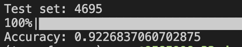
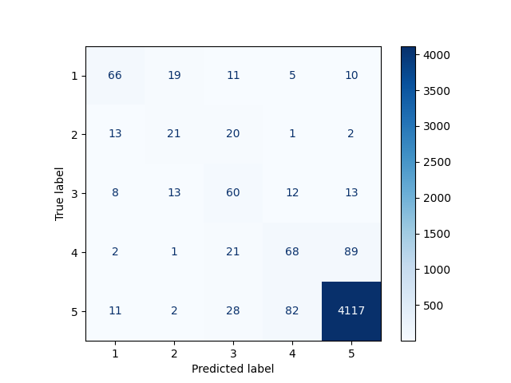

# 环境
pytorch 1.8.1
transformers 4.6.1

# 训练
```
python train.py
```
- 数据集9:1划分为训练集和验证集
- 模型采用ditilbert
- 模型参数，训练日志会保存在`record`目录下
- `final_result`目录下是我已经训练好的模型和结果

# 测试
```
python test.py
```
- 调用`final_result`目录中的模型
- 测试准确率为92.27%
- 混淆矩阵



